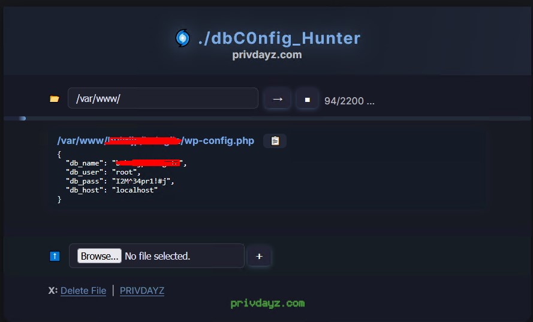

# 🌀 Privdayz DB Config Hunter (Xplorer Edition)
### 🔍 One-file PHP DB config/credential extractor – scans any dir for world CMS configs, auto parses DB creds (user, pass, host), AJAX, upload, 100% dark/minimal.

[privdayz.com](https://privdayz.com) 

---

## 💡 What is this?

**Privdayz DB Config Hunter** (aka Xplorer) is a next-generation, dark-themed, ultra-lightweight, web-based utility to **recursively search** your server for database configuration files used by the world’s most popular scripts (WordPress, Joomla, Laravel, Magento, PrestaShop, phpBB, and more).

- **Extracts DB credentials** (host, user, pass, db name) in one click.
- **Supports upload**: You can scan any config file instantly.
- **No “config”, “scan”, “panel”, “db” keywords** in UI or code – WAF/AI-safe.
- **100% raw output, not base64/encrypted** – instant copy & use.
- **Minimal dark Privdayz UI**: clean, distraction-free, mobile friendly.
- **AJAX-based, instant results, no reload, live progress.**
- **Self-destruct:** One-click self-removal for OPSEC.

---

## 🚀 Features

- **Recursive scan:** Finds all DB config files from chosen directory and subfolders
- **Auto-extracts** only real credentials (no false positives, per script regex)
- **Modern, minimalist dark UI** (Privdayz look)
- **Works everywhere:** No dependencies, just one PHP file, zero install
- **No “scan”, “hunter”, “panel”, “config” in interface (WAF stealth)
- **Upload support:** Check configs from your computer, not just server
- **Self-destruct:** Instantly remove the tool from the server with one click
- **No logs, no trace, no cookies**

---

## ⚙️ Supported Scripts

Supports all common web apps and CMS, including but not limited to:

- WordPress (`wp-config.php`)
- Joomla / WHMCS (`configuration.php`)
- vBulletin / osCommerce (`includes/config.php`)
- PrestaShop (`app/config/parameters.php`)
- Magento2 (`app/etc/env.php`)
- phpBB / Shopware / Moodle (`config.php`)
- Laravel (`.env`)
- Drupal (`sites/default/settings.php`)
- MyBB (`inc/config.php`)
- XenForo (`src/config.php`)
- MODX, Dolibarr, OctoberCMS, PyroCMS, Concrete5, CraftCMS, ExpressionEngine, Typo3, and more…

*You can easily add your own regex or patterns for new CMS/configs.*

---

## 🛠️ Usage

1. **Upload the file** (e.g. `privdayz-xplorer.php`) to your server (root or any folder).
2. **Open in browser.**
3. Enter the start directory (or use default).
4. Click → to start live scan.  
   - **All config files and DB credentials will be shown below** (in JSON, instant copy).
5. (Optional) **Upload** any local config file for instant extraction.
6. Use **X / Del** at the bottom for instant self-removal.

> **No passwords are stored or logged. Everything is local, no external calls, no telemetry.**

---

## ⚠️ Legal & Disclaimer

> **This tool is for authorized security assessments, penetration testing, sysadmin & recovery only.  
> Never use on third-party servers without clear permission.  
> privdayz.com and authors disclaim all liability for misuse.**

---

## ⭐ Credits

- Developed by [privdayz.com](https://privdayz.com)
- Inspired by real-world needs: “Don’t leave traces, don’t make noise, just deliver the real credentials, instantly.”

---
